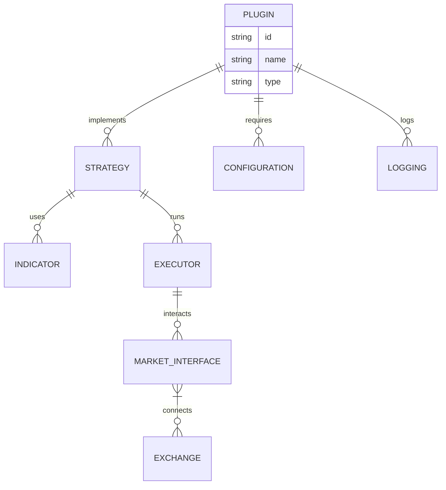

<br />

<br />
<p align="center">
  <a href="https://firefly-iii.org/">
    
  </a>
</p>
  <h1 align="center">Firefly III</h1>

[](https://discord.com/invite/xPHTuHCmuV)
[](https://vscode.dev/redirect?url=vscode://ms-vscode-remote.remote-containers/cloneInVolume?url=https://github.com/OpenBB-finance/OpenBB)
<a href="https://codespaces.new/OpenBB-finance/OpenBB">
  
</a>
<a target="_blank" href="https://colab.research.google.com/github/OpenBB-finance/OpenBB/blob/develop/examples/googleColab.ipynb">
  
</a>
[](https://pypi.org/project/openbb/)


## Why Firefly Plugins?
Firefly Plugins let you **build once, use anywhere** across backtests, paper trading, and live markets.

<p align="center">
	
</p>

They are:
- 🔌 Modular & reusable components
- 📦 Environment-agnostic (backtest, sandbox, live)
- 🧩 Easy to plug into any strategy or workflow
- 🌐 Exchange-agnostic with unified interfaces

Create, share, or combine plugins for indicators, strategies, risk controls, and more — all while keeping your code clean and scalable.

## Features

* Import from over 6000 banks
* Import over the command line for easy automation
* Import over an API for easy automation
* Use rules and data mapping for transaction clarity

"Firefly III" is a (self-hosted) manager for your personal finances. It can help you keep track of your expenses and income, so you can spend less and save more. Firefly III supports the use of budgets, categories and tags. Using a bunch of external tools, you can import data. It also has many neat financial reports available.

Firefly III should give you **insight** into and **control** over your finances. Money should be useful, not scary. You should be able to *see* where it is going, to *feel* your expenses and to... wow, I'm going overboard with this aren't I?

But you get the idea: this is your money. These are your expenses. Stop them from controlling you. I built this tool because I started to dislike money. Having money, not having money, paying bills with money, you get the idea. But no more. I want to feel "safe", whatever my balance is. And I hope this tool can help you. I know it helps me.

<p align="center">
  
</p>

### Trade Stocks, Crypto, Futures, and Forex

```python
from Firefly import Alpaca, CoinbasePro

stocks = Alpaca()
crypto = CoinbasePro()
futures = BinanceFutures()

# Easily perform the same actions across exchanges & asset types
stocks.interface.market_order('AAPL', 'buy', 1)
crypto.interface.market_order('BTC-USD', 'buy', 1)
# Full futures feature set
futures.interface.get_hedge_mode()
```

### Backtest your trades, events, websockets, and custom data

```python
import Firefly
"""
This example shows how backtest over tweets
"""

class TwitterBot(Firefly.Model):
    def main(self, args):
        while self.has_data:
            self.backtester.value_account()
            self.sleep('1h')

    def event(self, type_: str, data: str):
        # Now check if it's a tweet about Tesla
        if 'tsla' in data.lower() or 'gme' in data.lower():
            # Buy, sell or evaluate your portfolio
            pass


if __name__ == "__main__":
    exchange = Firefly.Alpaca()
    model = TwitterBot(exchange)

    # Add the tweets json here
    model.backtester.add_custom_events(Firefly.data.JsonEventReader('./tweets.json'))
    # Now add some underlying prices at 1 month
    model.backtester.add_prices('TSLA', '1h', start_date='3/20/22', stop_date='4/15/22')

    # Backtest or run live
    print(model.backtest(args=None, initial_values={'USD': 10000}))

```

#### Accurate Backtest Holdings

<div align="center">
    <a></a>
</div>


## 🛠️ Installation

Follow the steps below to install and run this project on your local machine.

### 1. 📦 Prerequisites

Make sure you have the following tools installed on your system:

- [Node.js](https://nodejs.org/)  (v14.x or newer)
- [npm](https://www.npmjs.com/)  (comes with Node.js)
- [Git](https://git-scm.com/) 
- Python 3.x (optional, if any indicators or tools require it)

> You can also use Docker to run the project in an isolated environment.

### 3. 📦 Install Dependencies

Install the required npm packages:

```bash
npm install
```

If the plugin uses Python-based tools or indicators, install the Python dependencies as well:

```bash
pip install -r requirements.txt
```

---

### 4. 🔐 Set Up Exchange API Keys

To allow the plugin to interact with cryptocurrency exchanges, set up your API credentials.

Create a `.env` file in the root directory and add your exchange keys:

```env
EXCHANGE_API_KEY=your_api_key_here
EXCHANGE_SECRET_KEY=your_secret_key_here
```

> Make sure not to commit this file to version control. It should remain private.

---

### 5. ⚙️ Configure the Plugin

Each plugin comes with a configuration file. For example:

```yaml
# config/rsi-config.yaml
strategy:
  rsi_period: 14
  overbought_threshold: 70
  oversold_threshold: 30
  symbol: BTC/USDT
  interval: "1h"
```

You can modify these values based on your trading preferences.

---

### 6. ▶️ Run the Plugin

Once everything is set up, start the plugin:

```bash
npm start -- --plugin rsi --config config/rsi-config.yaml
```

Or, if you're using a custom script:

```bash
node index.js --plugin rsi --config config/rsi-config.yaml
```

---

### 7. 🐳 Optional: Run with Docker

Build and run the plugin using Docker:

```bash
docker build -t Firefly-rsi-plugin .
docker run -it --env-file .env Firefly-rsi-plugin
```




<p align="center">
    
</p>

<p align="center">
  </center>
</p>

## Contributors

 wouldn't be  without you. If we are going to disrupt financial industry, every contribution counts. Thank you for being part of this journey.

<a href="https://github.com/OpenBB-finance/OpenBB/graphs/contributors">
   
</a>
